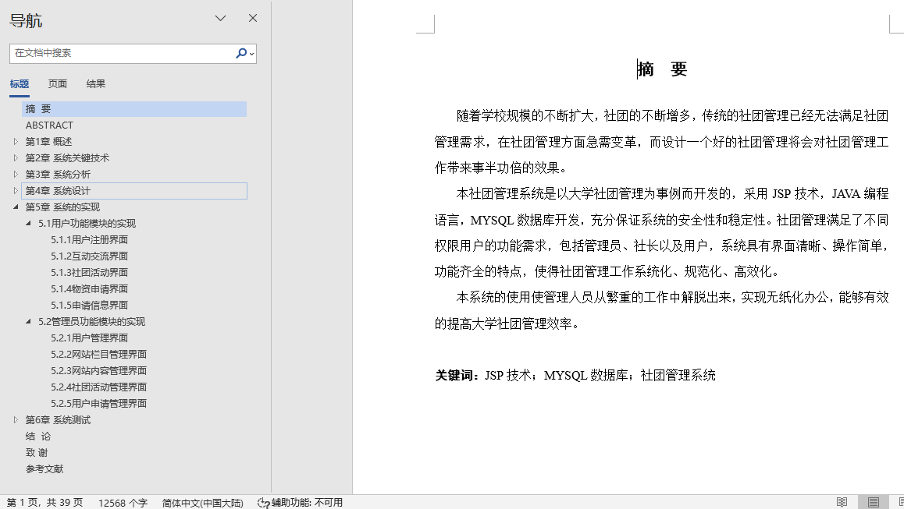
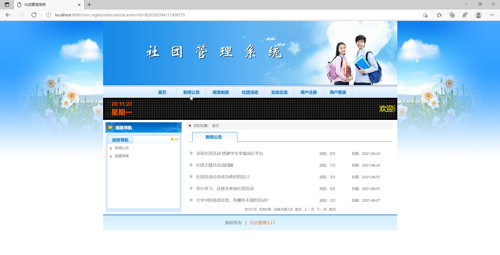
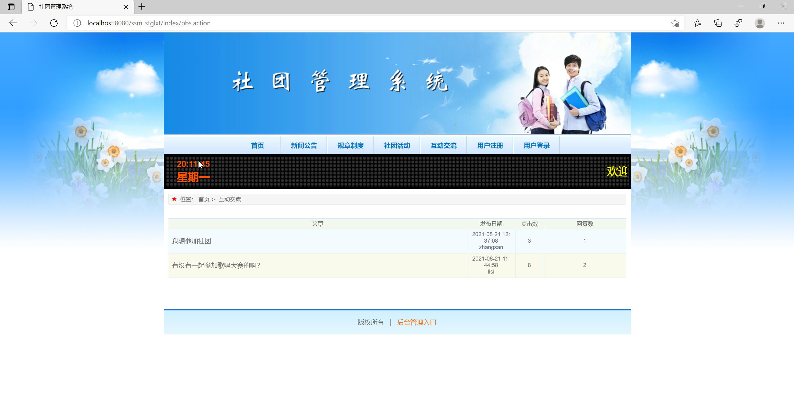
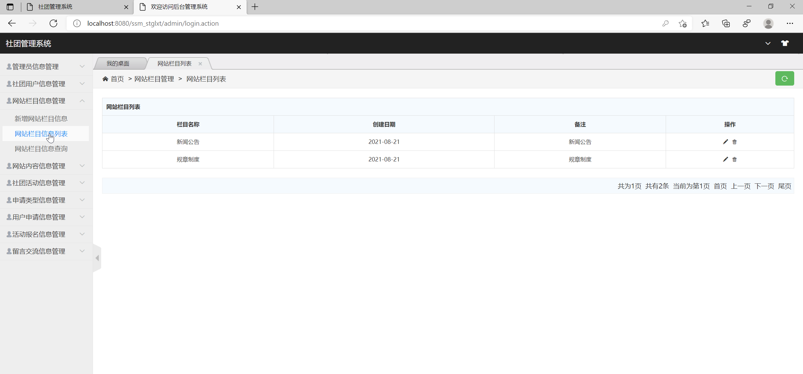
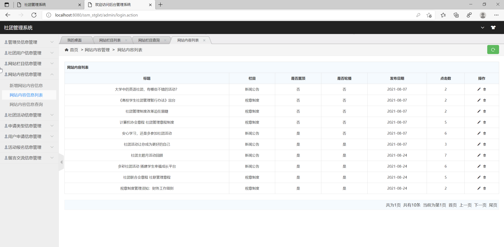
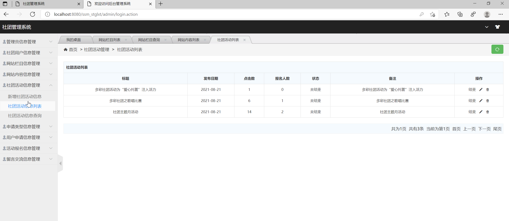
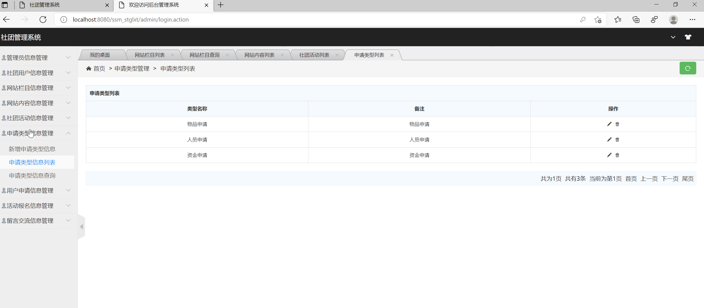
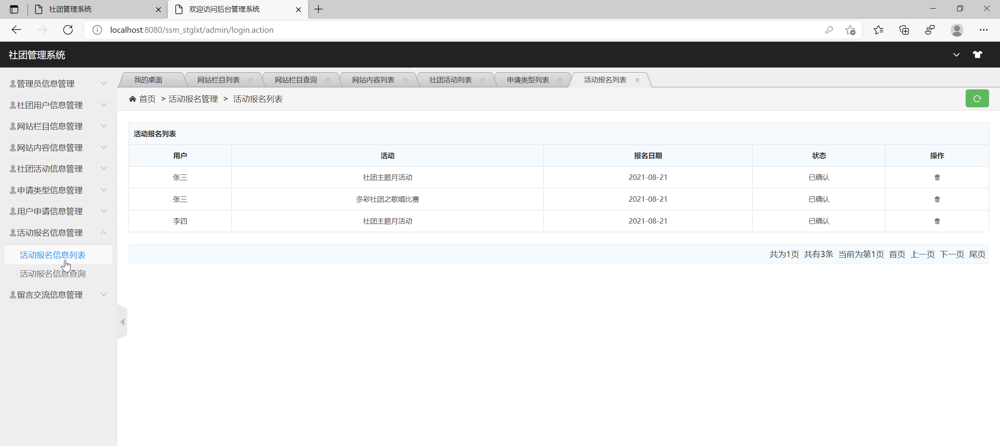
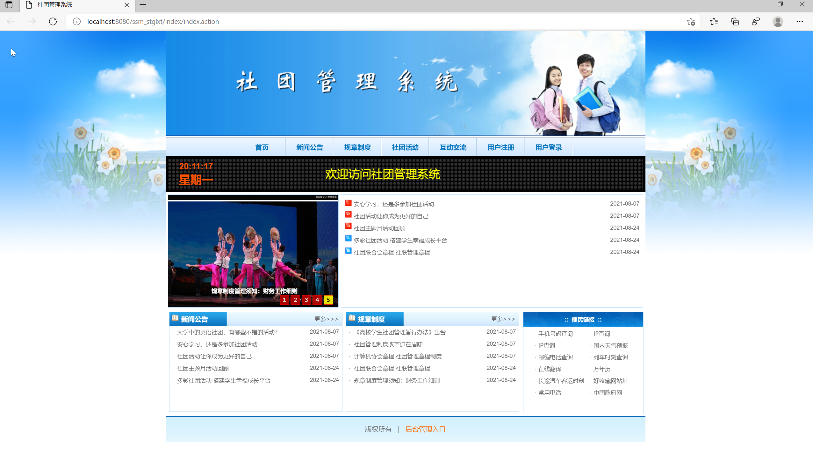

## 基于SSM框架的社团管理系统(程序+报告)

###  获取sql数据库文件: 从戎源码网 (https://armycodes.com/) QQ: 386869957 QQ群: 377586148
###  所有系统地址: (https://github.com/YuLin-Coder/AllProjectCatalog) 
###  所有项目以及源代码本人均调试运行无问题 可支持远程安装部署调试、定制修改、代码讲解

## 项目介绍
基于SSM框架的社团管理系统，该系统主要分为前台和后台两大功能模块，共包含两个角色：用户、管理员。具体的系统功能如下：
1.前台功能
前台首页、新闻公告、规章制度、社团活动、活动报名、互动交流、用户注册、用户登陆、用户中心、修改密码、个人信息、我的社团活动、物资申请、退出登陆等功能。
2.后台功能
后台系统登陆、社团用户管理、管理员管理、网站公告管理、社团活动管理、申请类型管理、用户申请管理、活动报名管理、留言交流管理等功能。

## 项目技术
- 编程语言：Java
- 数据库：MySQL
- 前端技术：JSP、jQuery 、H-ui
- 后端技术：Spring、SpringMVC、MyBatis

## 运行环境
- JDK版本：JDK1.8及以上
- 开发工具：IDEA、Ecplise、Myecplise都可以
- 数据库: MySQL5.7及以上

## 运行截图

